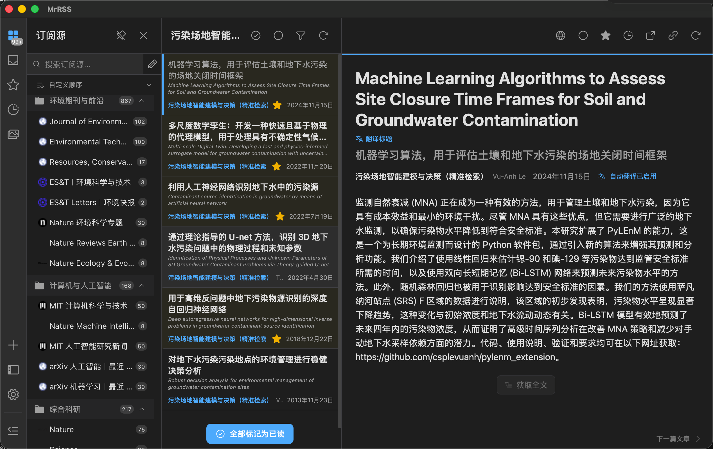

# RSS System Builder · 个人主题 RSS 体系搭建

**告诉 AI 你关心什么，让它帮你搭建、验证和维护一套适合自己的信息订阅体系。**

A reusable agent skill for personalized RSS discovery, verified subscriptions, relevance tuning, translation, and optional research-aware notifications.

它是一套供 Codex 等支持 `SKILL.md` 的智能体读取的工作说明，附带 OPML 生成工具；**不是独立 RSS 阅读器，也不是安装后就会自行运行的推送服务**。你可以换成自己的学科、项目、兴趣、语言和设备，不必照搬示例。

## 实际阅读效果



图：经使用者明确授权公开的真实 MrRSS 阅读截图，展示分类订阅、阅读列表和中文机器翻译。截图中的订阅类别、文章与收藏标记属于该实例，不是其他用户的默认配置；包含历史文献，不代表全部是最新论文。MrRSS 是独立第三方阅读器，并非本项目开发的界面。

下文文字示例使用通用占位符或虚构主题，不披露额外的个人研究笔记、账号或机器配置。

提供兴趣与需求 → 验证来源并分类 → 导入阅读器 → 按需配置翻译、同步与精选通知。

阅读器可按“长期兴趣”“领域前沿”“近期问题”组织内容。机器翻译仍需核对专业术语；订阅摘要不代表能获取或翻译论文全文。

## 这个 skill 能帮你做什么？

| 需求 | 智能体按 skill 执行的工作 | 边界 |
| --- | --- | --- |
| 按主题订阅 | 将研究问题、方法、领域和排除项整理成兴趣档案，寻找官方 RSS/Atom 和检索源 | 不是固定期刊清单；来源要在实际网络中验证 |
| 兼顾精准与广泛 | 保留学科前沿、综合期刊等广域频道，再增加课题专题或排序 | 不默认把非课题文章全部隐藏 |
| 中文阅读 | 区分界面语言、标题、摘要和正文翻译，配置合适的方案并抽查术语 | 不强制 Ollama 或特定模型；可用全文与版权权限有关 |
| 可迁移订阅 | 输出主题档案、验证记录和标准 OPML | OPML 不同步已读、收藏或翻译缓存 |
| 跟随研究进展 | 从用户指定的当前问题/笔记提取临时关注方向，调整排序或专题 | 需要授权资料来源及另行配置定期任务 |
| 手机与手表提醒 | 按需接入 Bark 等渠道，去重、控制条数并测试收件 | 需要设备密钥、通知权限和真实运行的调度器 |
| 已有系统调优 | 检查刷新失败、误匹配和翻译问题，尽量保留已读与收藏 | 不默认更换阅读器、修改全局网络或清空订阅 |

仓库内实际可执行的辅助工具只有 `scripts/build_opml.py` 及其测试。搜索、阅读器配置、翻译与通知接入由使用此 skill 的智能体结合用户环境实施；仓库没有预装模型、账号、同步后端或 Bark 推送程序。

## Mac 阅读器推荐：MrRSS

如果你主要在 **Mac 上阅读 RSS，希望中文界面并结合文章翻译**，本项目推荐将 **MrRSS** 作为优先考虑的桌面阅读器。它是免费开源项目，提供 macOS 安装包，支持文章标题与内容翻译，以及筛选、脚本等扩展功能；本页截图展示的就是它的实际使用效果。[官方项目与中文说明](https://github.com/DevXDojo/MrRSS/blob/main/README_zh.md)

推荐的搭配是：**本 skill 负责按兴趣组织和验证订阅，MrRSS 负责阅读与管理，轻量本地模型负责按需翻译**。这是适合中文桌面阅读的一种方案，不要求已有满意阅读器的用户迁移。

上手步骤：

1. 从 [MrRSS 官方 Releases](https://github.com/DevXDojo/MrRSS/releases/latest) 获取适合 Mac 的安装包；官方文档列出的标准包名为 `MrRSS-{version}-darwin-universal.dmg`，以实际发布附件为准。
2. 安装打开后，在设置中选择简体中文，并导入本 skill 生成的 OPML；已有订阅先备份，不清空收藏和已读状态。
3. 如需本地英文转中文，按 [本地翻译指南](references/local-translation.md) 配置模型，并核对当前 MrRSS 版本的提供商与接口选项。
4. 先刷新少量来源，检查标题、摘要和正文各自的显示结果，再按自己的需求设置刷新间隔。

注意：阅读器免费不代表所选云端 AI 服务免费；本地模型仍消耗磁盘和内存。同步与 Bark / Apple Watch 通知需要分别配置验证，不能仅靠安装 MrRSS 自动获得。不同版本的翻译、全文提取和后台行为可能变化，实施时参阅 [MrRSS 注意事项](references/mrrss.md)。

## 安装与使用

需要一个能读取本地 skill 的智能体环境；OPML 工具使用 Python 3.9+ 标准库，不需要第三方 Python 包。RSS 阅读器、翻译服务、通知渠道和智能体本身的费用取决于你的选择，本仓库不提供这些服务或额度。

可以把仓库链接交给支持 skill 安装的智能体，要求安装。也可以手动放入它实际使用的技能目录。当前 Codex 官方文档列出的个人技能目录是 `~/.agents/skills`，项目内为 `.agents/skills`；部分已有环境另有配置目录（例如 `~/.codex/skills`），以你的安装环境为准，避免重复安装。[官方技能目录说明](https://learn.chatgpt.com/zh-Hans/docs/customization/overview)

例如，在支持上述个人目录的 macOS/Linux 环境执行：

```bash
mkdir -p ~/.agents/skills
git clone https://github.com/b619-y/rss-system-builder.git ~/.agents/skills/rss-system-builder
```

如果目标已存在，先检查现有版本，不要覆盖。安装后开启新任务，输入：

```text
使用 $rss-system-builder 帮我搭建 RSS 体系。
长期兴趣：[填写领域 A、领域 B]。
近期问题：[填写目前希望解决的问题]。
请兼顾近期问题与领域前沿，不要把订阅限制为单一关键词。
语言、预算与设备：[填写自己的需求]。
先验证来源，再导入我选择的阅读器。
```

虚构的跨领域示例：

```text
使用 $rss-system-builder。我关注天文学与科学教育。
请兼顾系外行星研究、观测技术及科普教学，排除占星内容。
希望跨设备同步已读状态；先核实可选方案的费用与限制。
```

## 轻量本地英文 → 中文翻译

skill 包含可选的 **TranslateGemma 4B + Ollama** 配置流程：使用 `translategemma:4b` 在本机把英文标题、摘要和已获取的正文翻成简体中文。官方仓库对应量化版本约 3.3 GB，但运行内存还受文本长度等因素影响；不代表所有设备上效果最好。[模型信息](https://ollama.com/library/translategemma:4b)

流程涵盖模型检查与按需下载、公开短句测试、空闲卸载、阅读器接入、长文分段、术语核对及禁止未经同意的云端回退。它不强制使用 Ollama，也不捆绑模型；翻译摘要不等于获取论文全文。

```text
使用 $rss-system-builder，为我的 RSS 配置轻量本地英文转简体中文。
先检查现有模型；若适合我的硬件，可采用 TranslateGemma 4B。
我需要中文标题和摘要，正文按需翻译，保留原文方便对照。
控制内存占用，不自动回退到云端翻译，并验证实际效果。
```

详细步骤及可运行测试命令见 [本地翻译指南](references/local-translation.md)。这里公开的是通用方案，不包含任何个人机器配置或翻译内容。

## 随“最近关注的问题”调整

采用“长期兴趣 + 临时问题”两层结构：长期频道持续提供广度，临时问题影响精选顺序或专题检索。不是每次研究方向略变就删掉原来的订阅。

你可以提供一份自己维护的文件，例如：

```markdown
# 当前研究问题
更新时间：填写日期
长期兴趣：[填写希望持续了解的领域]
最近问题：[填写当前研究或学习问题]
需要的证据：[填写案例、实验、综述或方法等]
暂不需要：[填写明确的排除项]
下次复核：填写日期
```

然后明确授权：

```text
只读取我指定的“当前研究问题.md”，每周一检查是否更新。
据此调整精选排序和专题关键词，保留长期广域频道，不自动删源。
请配置实际定期任务，告诉我运行时间、依赖和验证结果。
```

具体执行规范见 [动态关注与通知](references/adaptive-focus.md)。仅安装 skill 不会读取你的其他聊天、远程服务器或全部笔记，也不会自动创建定时任务。

## Bark / Apple Watch 通知

通知是可选的实施步骤，不随仓库自动启用：安装并授权通知 → 将设备密钥保存在本地私密配置 → 绑定发送端 → 发一条测试 → 用户确认手机和手表收件 → 启用选定的推送时间。

应先将已有文章作为历史基线，只给后续新增内容发送小份摘要；按关注领域平衡条目、去重，无新增不打扰。Bark 服务接受消息不等于手表已收到。Apple Watch 的通知去向与 iPhone 是否锁定、手表是否佩戴解锁及镜像设置有关。[Apple 通知说明](https://support.apple.com/zh-cn/108369) · [Bark 项目](https://github.com/Finb/Bark)

设备密钥不可上传 GitHub；通过通知服务发送的公开文章标题和链接也会经过该服务。默认不要发送未发表课题内容或原始笔记。

## OPML 工具

按 [manifest 格式](references/manifest.md) 准备 `manifest.json`，然后在本仓库目录执行：

```bash
python3 scripts/build_opml.py manifest.json --check
python3 scripts/build_opml.py manifest.json --output subscriptions.opml
python3 -B -m unittest discover -s scripts -p 'test_*.py' -v
```

工具检查结构、重复 URL、XML 和 URL 中的用户名密码，按分组生成 OPML，拒绝覆盖文件；**不访问网络，也不能发现所有藏在 URL 查询参数中的密钥**。网络有效性和分享前隐私检查仍需另外完成。

## 文件说明

- [SKILL.md](SKILL.md)：智能体的主工作流程与边界。
- [references/manifest.md](references/manifest.md)：来源清单与 OPML 格式。
- [references/adaptive-focus.md](references/adaptive-focus.md)：近期研究问题、定期更新、通知与隐私约束。
- [references/local-translation.md](references/local-translation.md)：轻量本地英文转中文、资源控制与阅读器接入。
- [references/mrrss.md](references/mrrss.md)：MrRSS 的实测注意事项，使用前须核对版本。
- [scripts/build_opml.py](scripts/build_opml.py)：可独立使用的 OPML 生成器。
- [agents/openai.yaml](agents/openai.yaml)：技能名称及默认调用提示。

本项目与 MrRSS、OpenAI、Bark 及截图中的期刊无隶属关系。第三方名称、界面和文章内容归各自权利人所有，截图仅用于说明阅读效果。分享真实阅读截图前须取得授权并检查可见信息；不得提交个人数据库、账号配置、通知密钥或未发表研究资料。GitHub 仓库所有者用户名及公开提交信息仍按平台规则可见；公开仓库并不等于匿名发布。
